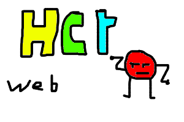

# 
## HCT (Hyper Content Text) 
Developed by Youssef Erradi v 0.0.1 alpha

HCT is a hybrid markup language that combines the power of HTML with the 
simplicity of BBCode. It was designed specifically for the Erradi Website 
and Cyber-Web projects to allow fast, secure, and styled content creation.
```

[ts1] to [ts6]      - Cyber-Web Headers (h1-h6)
[t]                 - Text Paragraph
[b], [i], [s]       - Bold, Italic, and Underline
[center]            - Center Alignment
[left] / [right]    - Side Alignment
[color=VALUE]       - Custom Text Color (Names or Hex)
[url=LINK]Text[/url]- Hyperlinks
[img]LINK[/img]     - Image Embedding
[atri-hct-game]     - Embeds the Scratch HCT Game Engine
```
it's *fast for wirte* and *good for web*
